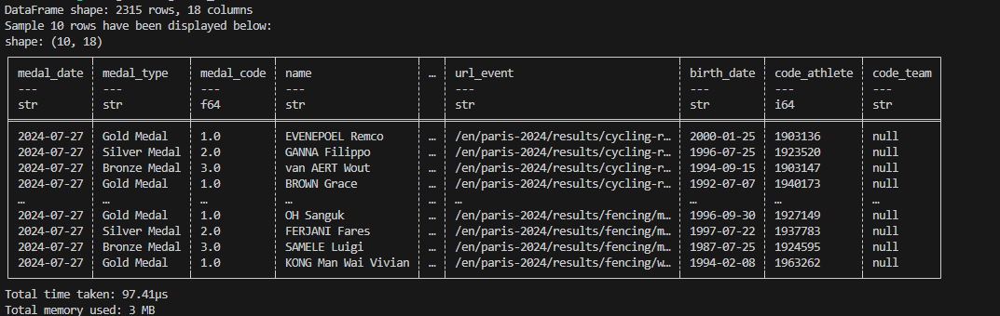

# Mini Project: Comparing performances between Python and RUST
Adil Keku Gazder  
ag825, adil.gazder@duke.edu  
IDS 706: Data Engineering Systems  
Duke University, Fall 2024  
##

### About the project

This project aims to compare the performances of basic operations on Python vs RUST. We read a .csv file into a dataframe and print out the shape and first 10 rows of the dataframe. We compare the time and memory used in both cases.

The dataset used for this project was acquired from Kaggle (Olympic Summer Games - Paris 2024 -> medallists.csv). Link to the dataset: (https://www.kaggle.com/datasets/muhammadehsan02/olympic-summer-games-paris-2024?select=medallists.csv)

##
### Repository Structure
The structure of this file is as follows:
- .gitignore file
- .github/workflows file
    - Used to define an automated process which will run the pipeline before publishing
        - python_cicid.yml file for CI CD operations of the Python script
        - rust_cicd.yml file for CI CD operations on the RUST script
- rust_code
    - src file
        - main.rs: Calls the read function from lib.rs
        - lib.rs: Reads data from a .csv file into a dataframe, prints out the shape and top 10 rows from the dataset
    - target folder
    - Cargo.toml: Mentions dependancies needed to run the program
    - Cargo.lock
    - Makefile: makefile for the RUST module
- Makefile
    - Compilation and maintainence of code
    - Helps manage dependinces
    - Install / Format / Lint / Test
- Requirements file
    - Text file (.txt) detailing the required packages to be installed for this program to run
- main.py
    - read(): Reads data from a .csv file into a dataframe, prints out the shape and top 10 rows from the dataset
- testmain.py
    - Tests that the function read() in main.py work as expected
- medallists.csv
    - Source data in .csv format

##
### Outputs and Results
This file generates the following on execution:
- Shape of the input data frame
- Top 10 rows from the dataframe
- Time taken to process
- Memory utilized to process

| Metric                | Python Code                   | Rust Code          | 
|-----------------------|---------------------------|----------------|
| **Time taken**  | `0.096 sec`                  | `383.806 usec`        |                                     |
| **Memory consumed**      | `29.69 MB` | `4460 MB` | ~40% faster                          |

We do notice that although the RUST code runs much faster, it does tend to consume more memory during the execution process. This is an intrinsic tradeoff which must be evaluated on a case by case basis.

> Output generated from the Python code execution:

> Output generated from the RUST code execution:
